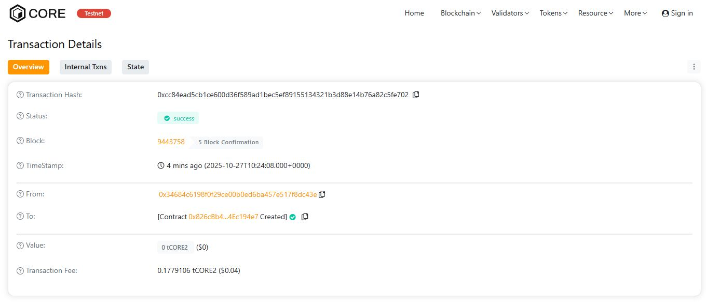

# MetaBond Network

## Project Description

MetaBond Network is a decentralized blockchain platform that revolutionizes the traditional bond market by enabling transparent, secure, and efficient issuance, trading, and management of digital bonds. Built on Ethereum, this smart contract solution eliminates intermediaries, reduces costs, and provides real-time settlement for bond transactions.

The platform allows bond issuers (governments, corporations, or institutions) to create digital bonds with customizable parameters including face value, maturity dates, and coupon rates. Investors can purchase these bonds directly on-chain and claim periodic coupon payments automatically, bringing unprecedented transparency and efficiency to fixed-income securities.

## Project Vision

Our vision is to democratize access to the global bond market by leveraging blockchain technology. MetaBond Network aims to:

- **Eliminate Barriers**: Remove traditional intermediaries and reduce entry barriers for both issuers and investors
- **Enhance Transparency**: Provide complete visibility into bond issuance, ownership, and payment schedules
- **Enable Global Access**: Allow participants from anywhere in the world to issue and invest in bonds 24/7
- **Reduce Costs**: Significantly lower transaction costs associated with bond trading and settlement
- **Automate Payments**: Implement smart contract-based coupon payments and maturity settlements
- **Build Trust**: Create an immutable record of all bond transactions and ownership changes

By bridging traditional finance with decentralized technology, MetaBond Network seeks to create a more inclusive, efficient, and transparent fixed-income market for the digital age.

## Key Features

### 1. **Decentralized Bond Issuance**
   - Issuers can create custom bonds with specific parameters
   - Set face value, maturity date, coupon rate, and total supply
   - No intermediaries required for bond creation
   - Instant on-chain registration

### 2. **Direct Bond Purchase**
   - Investors purchase bonds directly from issuers
   - Transparent pricing based on face value
   - Automatic payment routing to issuers
   - Real-time supply tracking

### 3. **Automated Coupon Payments**
   - Monthly coupon claim mechanism
   - Automatic calculation based on holding period
   - Transparent payment history on-chain
   - No manual intervention required

### 4. **Transparent Bond Information**
   - Public access to all bond details
   - Real-time availability tracking
   - Complete investment history
   - Immutable transaction records

### 5. **Secure Smart Contract Architecture**
   - Robust validation and security checks
   - Protected investor funds
   - Event emission for all major actions
   - Gas-optimized operations

## Future Scope

### Short-term Enhancements
- **Secondary Market Trading**: Enable peer-to-peer bond trading between investors
- **Bond Rating System**: Integrate decentralized credit rating mechanisms
- **Multi-currency Support**: Accept payments in various cryptocurrencies and stablecoins
- **Mobile Application**: Develop user-friendly mobile interface for bond management

### Medium-term Goals
- **Fractional Bonds**: Allow purchase of bond fractions for smaller investors
- **Yield Aggregation**: Implement strategies to optimize returns across multiple bonds
- **Oracle Integration**: Connect with external data feeds for real-time interest rates
- **DAO Governance**: Community-driven decision making for platform parameters
- **Cross-chain Compatibility**: Deploy on multiple blockchain networks

### Long-term Vision
- **Institutional Integration**: Partner with traditional financial institutions
- **Regulatory Compliance Modules**: Built-in KYC/AML compliance features
- **Advanced Financial Instruments**: Support for convertible bonds, callable bonds, and derivatives
- **AI-powered Analytics**: Intelligent portfolio management and risk assessment
- **Global Bond Index**: Create benchmark indices for digital bond markets
- **Insurance Integration**: Partner with DeFi insurance protocols for investor protection

---

## Technical Specifications

- **Solidity Version**: ^0.8.19
- **License**: MIT
- **Network Compatibility**: Ethereum and EVM-compatible chains
- **Gas Optimization**: Efficient storage patterns and batch operations

## Project Structure

```
MetaBond-Network/
├── contracts/
│   └── Project.sol          # Main smart contract
├── scripts/
│   └── deploy.js            # Deployment script
├── test/
│   └── Project.test.js      # Test suite (to be added)
├── hardhat.config.js        # Hardhat configuration
├── package.json             # Project dependencies
├── .env.example             # Environment variables template
└── README.md                # Project documentation
```

## Getting Started

### Prerequisites
- Node.js (v16 or higher)
- npm or yarn package manager
- Hardhat development environment
- MetaMask or compatible Web3 wallet

### Installation

```bash
# Clone the repository
git clone https://github.com/yourusername/metabond-network.git

# Navigate to project directory
cd metabond-network

# Install dependencies
npm install
```

### Environment Setup

Create a `.env` file in the root directory:

```env
PRIVATE_KEY=your_wallet_private_key_here
INFURA_API_KEY=your_infura_api_key_here
ETHERSCAN_API_KEY=your_etherscan_api_key_here
```

### Hardhat Configuration

Create a `hardhat.config.js` file:

```javascript
require("@nomicfoundation/hardhat-toolbox");
require("dotenv").config();

module.exports = {
  solidity: {
    version: "0.8.19",
    settings: {
      optimizer: {
        enabled: true,
        runs: 200
      }
    }
  },
  networks: {
    hardhat: {
      chainId: 1337
    },
    localhost: {
      url: "http://127.0.0.1:8545"
    },
    sepolia: {
      url: `https://sepolia.infura.io/v3/${process.env.INFURA_API_KEY}`,
      accounts: [process.env.PRIVATE_KEY]
    },
    mainnet: {
      url: `https://mainnet.infura.io/v3/${process.env.INFURA_API_KEY}`,
      accounts: [process.env.PRIVATE_KEY]
    }
  },
  etherscan: {
    apiKey: process.env.ETHERSCAN_API_KEY
  }
};
```

### Compilation

```bash
# Compile the smart contracts
npx hardhat compile
```

### Testing

```bash
# Run tests
npx hardhat test

# Run tests with gas reporting
REPORT_GAS=true npx hardhat test

# Run tests with coverage
npx hardhat coverage
```

### Deployment

#### Deploy to Local Network

```bash
# Start local Hardhat node
npx hardhat node

# In a new terminal, deploy
npx hardhat run scripts/deploy.js --network localhost
```

#### Deploy to Testnet (Sepolia)

```bash
npx hardhat run scripts/deploy.js --network sepolia
```

#### Deploy to Mainnet

```bash
# ⚠️ CAUTION: Deploying to mainnet uses real ETH
npx hardhat run scripts/deploy.js --network mainnet
```

## Usage Examples

### Issuing a Bond

```javascript
const bondName = "Corporate Bond 2025";
const faceValue = ethers.utils.parseEther("1"); // 1 ETH per bond
const maturityDate = Math.floor(Date.now() / 1000) + (365 * 24 * 60 * 60); // 1 year
const couponRate = 500; // 5% annual rate
const totalSupply = 1000; // 1000 bonds

await project.issueBond(
  bondName,
  faceValue,
  maturityDate,
  couponRate,
  totalSupply
);
```

### Purchasing Bonds

```javascript
const bondId = 1;
const amount = 10; // Purchase 10 bonds
const bond = await project.bonds(bondId);
const totalCost = bond.faceValue.mul(amount);

await project.purchaseBond(bondId, amount, { value: totalCost });
```

### Claiming Coupons

```javascript
const bondId = 1;
await project.claimCoupon(bondId);
```

## Smart Contract Functions

### Core Functions

- **`issueBond()`** - Create a new bond
- **`purchaseBond()`** - Purchase bond units
- **`claimCoupon()`** - Claim coupon payments

### View Functions

- **`getBondDetails()`** - Get bond information
- **`getInvestmentDetails()`** - Get investor position
- **`getTotalBonds()`** - Get total bonds issued
- **`bonds()`** - Access bond mapping
- **`investments()`** - Access investment mapping

## Security Considerations

- Always conduct thorough security audits before mainnet deployment
- Test extensively on testnets before deploying to mainnet
- Implement access controls and governance mechanisms
- Consider using multisig wallets for issuer accounts
- Monitor gas costs and optimize transactions
- Implement emergency pause functionality for production

## Contributing

We welcome contributions from the community! Here's how you can help:

1. Fork the repository
2. Create a feature branch (`git checkout -b feature/AmazingFeature`)
3. Commit your changes (`git commit -m 'Add some AmazingFeature'`)
4. Push to the branch (`git push origin feature/AmazingFeature`)
5. Open a Pull Request

Please ensure your code follows our coding standards and includes appropriate tests.

## Testing Guidelines

- Write comprehensive unit tests for all functions
- Test edge cases and failure scenarios
- Maintain minimum 80% code coverage
- Test gas optimization improvements
- Document test scenarios clearly

## License

This project is licensed under the MIT License - see the LICENSE file for details.

## Support & Community

- **Documentation**: [docs.metabond.network](https://docs.metabond.network)
- **Discord**: Join our community server
- **Twitter**: [@MetaBondNetwork](https://twitter.com/metabondnetwork)
- **Email**: support@metabond.network

## Acknowledgments

- OpenZeppelin for security best practices
- Ethereum Foundation for blockchain infrastructure
- Hardhat team for development tools
- Community contributors and supporters

---

## Roadmap

### Q1 2025
- ✅ Smart contract development
- ✅ Core functionality implementation
- 🔄 Security audit
- 🔄 Testnet deployment

### Q2 2025
- Frontend development
- Beta testing program
- Community building
- Partnership discussions

### Q3 2025
- Mainnet deployment
- Marketing campaign
- Exchange listings
- Mobile app launch

### Q4 2025
- Secondary market implementation
- Cross-chain expansion
- Institutional partnerships
- Advanced features rollout

---

**Disclaimer**: This is a proof-of-concept project. Users should conduct thorough audits and testing before deploying to mainnet or using with real funds. The developers assume no liability for any losses incurred through the use of this software.

**⚠️ Important**: Never share your private keys. Always use secure key management practices.

---

*Built with ❤️ by the MetaBond Network Team*

H address:0xcc84ead5cb1ce600d36f589ad1bec5ef89155134321b3d88e14b76a82c5fe702

